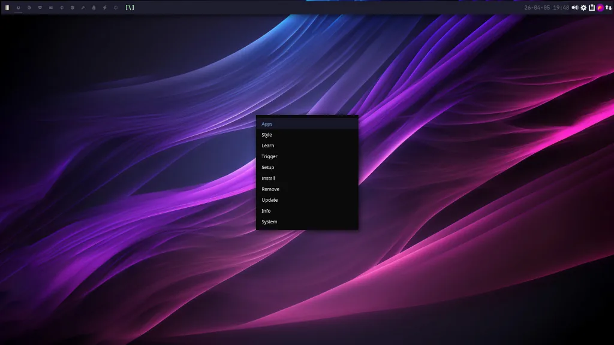
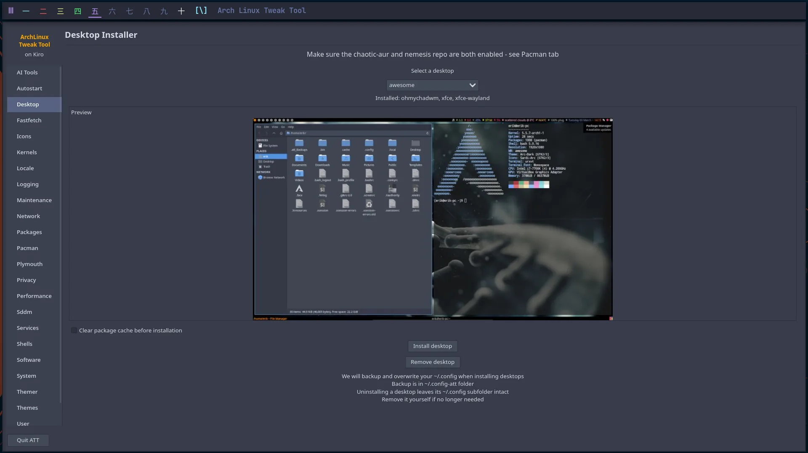
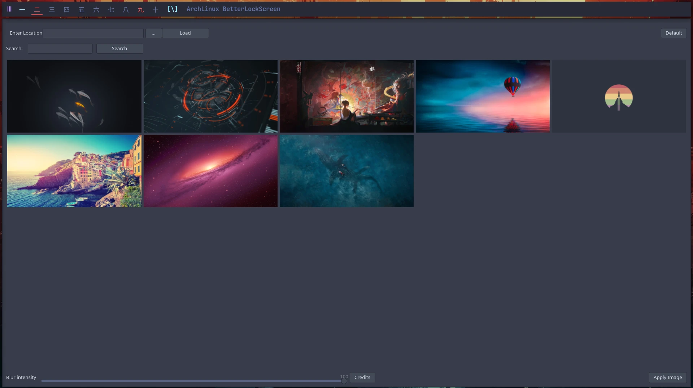
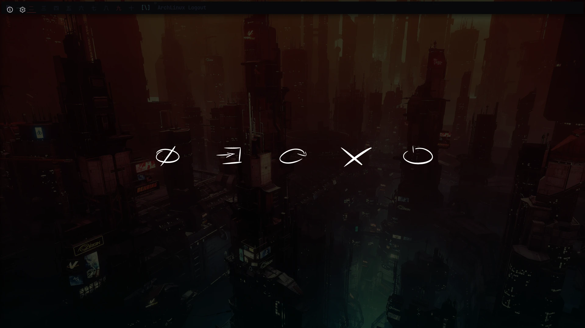

# kiro_repo

<p align="center">
  
</p>

The pacman package repository behind the **Kiro** ISO. It holds the
[Calamares](https://calamares.io) installer and Kiro's Calamares
configuration — on **stable** and **next** channels — the packages Kiro pulls
in at build and install time.

> **Note** — this repo is *installer-only by design*. After a normal Kiro
> install it is **not** added to your `/etc/pacman.conf`. (Looking for the
> extras you add *after* install, like Spotify? That's the separate
> `nemesis_repo`.) You can still opt in on any Arch system if you want it on a
> running machine.

## Add the repository

Append this to your `/etc/pacman.conf`, then run `sudo pacman -Syyu`:

```
[kiro_repo]
Server = https://kirodubes.github.io/$repo/$arch
```

> `kiro_repo` is PGP-signed by the Kiro key (trusted via `kiro-keyring`); it
> inherits your global `SigLevel`. Adding it by hand before the keyring is present?
> Use `SigLevel = Optional` for the repo until then.

## What's inside

A focused set — the Calamares installer plus Kiro's Calamares configuration,
each shipped on two channels (stable + testing):

- **calamares** / **calamares-next** — the GUI installer that drives the Kiro ISO's graphical install.
- **kiro-calamares-config** / **kiro-calamares-config-next** — Kiro's installer configuration.

## Screenshots

<table>
  <tr>
    <td align="center">
      <br />
      <sub>Calamares installer — start</sub>
    </td>
    <td align="center">
      <br />
      <sub>Calamares installer — finish</sub>
    </td>
  </tr>
  <tr>
    <td align="center">
      <br />
      <sub>ohmychadwm desktop</sub>
    </td>
    <td align="center">
      <br />
      <sub>XFCE desktop</sub>
    </td>
  </tr>
  <tr>
    <td align="center">
      <br />
      <sub>Arch Linux Tweak Tool</sub>
    </td>
    <td align="center">
      <br />
      <sub>Alacritty tweak tool</sub>
    </td>
  </tr>
  <tr>
    <td align="center">
      <br />
      <sub>Betterlockscreen</sub>
    </td>
    <td align="center">
      <br />
      <sub>Logout screen</sub>
    </td>
  </tr>
</table>

## Watch the videos

Playlist of all the KIRO videos — including the creation of BUILDRA based on KIRO:

https://www.youtube.com/watch?v=3jdKH6bLgUE&list=PLlloYVGq5pS71UubmlKjjw131PjixMIjW

The build tutorial — follow it and you are already half way there:

https://youtu.be/3jdKH6bLgUE

Live long and prosper.

# Major changes after the videos on YouTube

Make sure you read the major change at the bottom of the readme file on
https://github.com/kirodubes/kiro-iso

# Websites

Information : https://kiroproject.be

# Social Media

Youtube : https://www.youtube.com/erikdubois

<!-- KIRO-FUNDING-FOOTER:START — managed by Kiro-HQ/cascade-readme-footer.sh -->
## Help fund Kiro

Everything I build here stays free and open — always. If Kiro or any of these
tools have ever saved you time or taught you something, a small monthly
contribution helps keep the work going. Donations target break-even, nothing
more — the core always stays free for everyone.

- GitHub Sponsors: https://github.com/sponsors/erikdubois
- Patreon: https://www.patreon.com/c/kiroproject
- YouTube memberships: https://www.youtube.com/@ErikDubois/join
- Ko-fi: https://ko-fi.com/erikdubois
- PayPal: https://www.paypal.me/erikdubois
<!-- KIRO-FUNDING-FOOTER:END -->
